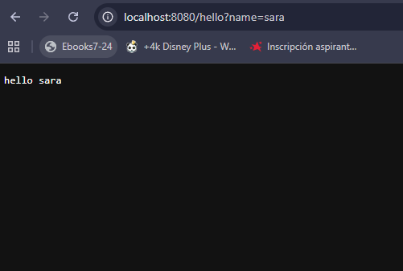
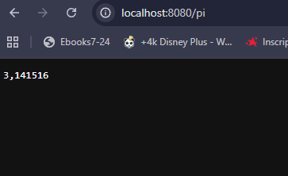
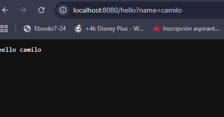
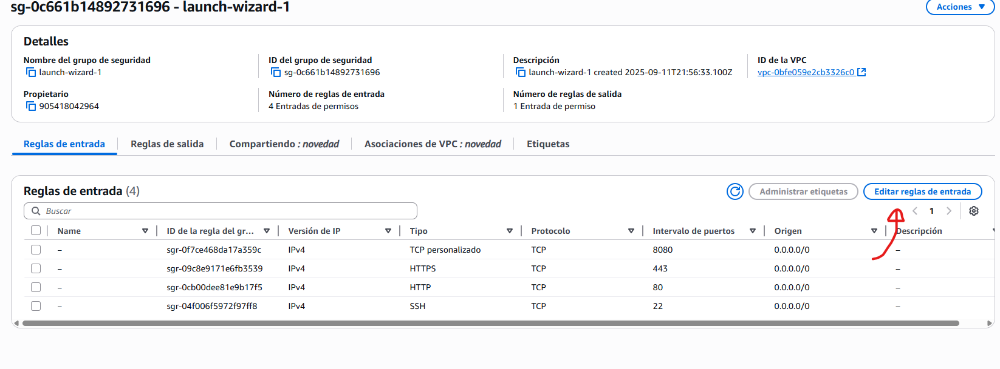
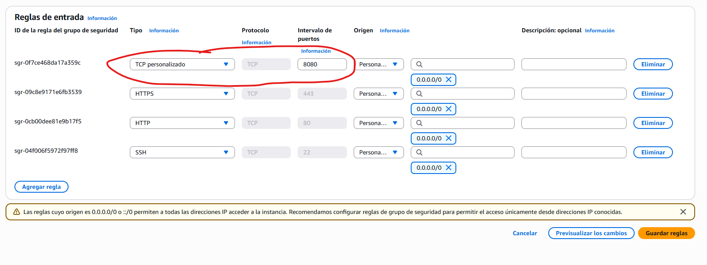
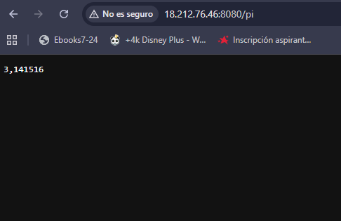
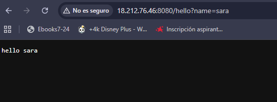

# Taller Parte 1: Creación de microSpring

`microSpring` es un micro-framework web para Java, ligero y basado en anotaciones, inspirado en los principios de Spark. Está diseñado para crear aplicaciones web y APIs de forma rápida y con una configuración mínima.

## Características

*   **Enrutamiento basado en anotaciones:** Define controladores y rutas de forma declarativa utilizando `@RestController` y `@GetMapping`.
*   **Manejo de parámetros de solicitud:** Extrae fácilmente parámetros de consulta de las URLs con la anotación `@RequestParam`.
*   **Ligero y simple:** Construido con un enfoque minimalista para un arranque rápido y un uso sencillo.
*   **Servidor de archivos estáticos (implícito):** Capaz de servir archivos directamente desde el sistema de archivos.

## Primeros Pasos

Sigue estas instrucciones para tener una copia del proyecto funcionando en tu máquina local.

### Prerrequisitos

*   Java Development Kit (JDK) 11 o superior
*   Apache Maven

### Instalación

1.  **Clona el repositorio:**
    ```bash
    git clone https://github.com/Santiago12323/microSpring
    cd microSpring
    ```

2.  **Construye el proyecto:**
    Usa Maven para compilar el código fuente e instalar las dependencias.
    ```bash
    mvn clean install
    ```

## Uso

El framework te permite crear endpoints web de una manera muy sencilla. Solo necesitas crear una clase, anotarla como un controlador y añadir métodos (hasta el momento solo GET), donde se le pueden pasar parámetros por query.

### 1. Crea un Controlador

Anota tu clase con `@RestController` para que el framework la reconozca como un controlador web.

### 2. Define las Rutas

Usa la anotación `@GetMapping("/ruta")` en los métodos que quieras exponer como puntos de enlace HTTP GET.

### 3. Maneja los Parámetros

Utiliza `@RequestParam("nombreParam")` en los argumentos de tu método para capturar los parámetros de la consulta de la URL.

### Ejemplo Completo

Aquí tienes un ejemplo de un controlador que define varias rutas, así podrás crear tus clases con el microFramework.

```java
package co.edu.escuelaing.arep.reflexionlab.controller;

import co.edu.escuelaing.arep.reflexionlab.Anotations.GetMapping;
import co.edu.escuelaing.arep.reflexionlab.Anotations.RequestParam;
import co.edu.escuelaing.arep.reflexionlab.Anotations.RestController;

import java.io.IOException;
import java.nio.file.Paths;

import static java.nio.file.Files.readAllBytes;

@RestController
public class Controller {

    @GetMapping("/hello")
    public String hello(@RequestParam(value = "name", defaultValue = "World") String name) {
        return "hello " + name;
    }

    @GetMapping("/pi")
    public String pi() {
        return "3.141516";
    }
    @GetMapping("/files")
    public String getFiles(@RequestParam("name") String fileName) {
        String basePath = "src/main/resources/public/";
        String filePath = basePath + fileName;

        try {
            byte[] fileBytes = readAllBytes(Paths.get(filePath));
            return new String(fileBytes);
        } catch (IOException e) {
            return "Error al leer el archivo: " + fileName;
        }
    }
}
```

### 4. Inicia la Aplicación

Para iniciar el servidor, el framework escaneará las clases en busca de anotaciones y las registrará automáticamente. Esto se hará colocando por consola:

```bash
java -cp target/classes co.edu.escuelaing.arep.reflexionlab.server co.edu.escuelaing.arep.reflexionlab.controller.Controller
```

## Ejemplos de Funcionamiento

-   `/hello` con nombre en el query:
    
    


-   `/hello` sin query:
    

-   `/pi` sin query:
    

-   Servidor de archivos estáticos con `/files` y query `name`:
    

---

# Taller Parte 2: Despliegue con Docker y AWS

Esta sección explica cómo empaquetar la aplicación en una imagen de Docker y desplegarla en una instancia EC2 de AWS.

## 1. Crear el Dockerfile

Crea un archivo llamado `Dockerfile` en la raíz de tu proyecto con el siguiente contenido. Este archivo define los pasos para construir la imagen de Docker.

```Dockerfile
# Usa una imagen base de OpenJDK 11
FROM openjdk:11

# Copia el archivo JAR de la aplicación a la imagen
COPY target/microSpring-1.0-SNAPSHOT.jar app.jar

# Expone el puerto 8080 para que la aplicación sea accesible
EXPOSE 8080

# Comando para ejecutar la aplicación cuando se inicie el contenedor
ENTRYPOINT ["java", "-jar", "app.jar"]
```

## 2. Empaquetar la Aplicación y Construir la Imagen Docker

Primero, asegúrate de que tu proyecto esté empaquetado como un JAR.

```bash
mvn clean package
```

Luego, construye la imagen de Docker usando el `Dockerfile`. 

```bash
# Construye la imagen de Docker
docker build -t micro-spring-boot:1.0 .     
```

## 3. Verificar la Imagen Localmente


```bash
# Muestra las imágenes de Docker locales
docker images
```



## 4. Subir la Imagen a Docker Hub

Para poder usar la imagen en AWS, primero debes subirla a un registro como Docker Hub.

```bash
# 1. Inicia sesión en Docker Hub
docker login

# 2. Sube la imagen a tu repositorio
docker push tu-usuario-docker/microspring
```
## y se vera de la siguiente forma


## 5. Desplegar en una Instancia EC2 de AWS


### a. Preparar la Instancia EC2

1.  Lanza una nueva instancia EC2.
2.  Conéctate a tu instancia EC2 por SSH.
 
3.  **Instala Docker** en la instancia:
    ```bash
    sudo dnf update -y
    sudo dnf install -y docker
    sudo systemctl enable docker
    sudo systemctl start docker
    ## y le permitimos al usuario ec2-user usar docker sin sudo
    sudo usermod -a -G docker ec2-user
    ```

4. ahora reiniciamos el servicio para que se vean los cambios
  ```bash
   newgrp docker
  ```

### b. Configurar el Grupo de Seguridad

1.  Ve a la configuración de tu instancia EC2 en la consola de AWS.
2.  Selecciona el **Grupo de Seguridad** asociado.
3.  Añade una nueva **regla de entrada** (Inbound Rule):
    *   **Tipo:** `Custom TCP Rule`
    *   **Protocolo:** `TCP`
    *   **Rango de Puertos:** `8080`
    *   **Origen:** `Anywhere` (0.0.0.0/0) o tu IP para mayor seguridad.



### c. Ejecutar el Contenedor en EC2

Ahora, desde tu sesión SSH en la instancia EC2, puedes descargar y ejecutar tu contenedor.

```bash
# 1. Descarga la imagen desde Docker Hub
docker pull tu-usuario-docker/microspring

# 2. Ejecuta el contenedor, mapeando el puerto 8080 del contenedor al 8080 de la instancia
docker run -d -p 8080:8080 tu-usuario-docker/microspring
```
## ahi vemos que esta arriba el contendor y vemos los logs del contendor y esta por el puert 8080


### d. Verificar la Aplicación

¡Y listo! Ahora puedes acceder a tu aplicación abriendo un navegador y visitando la IP pública de tu instancia EC2 en el puerto 8080.




