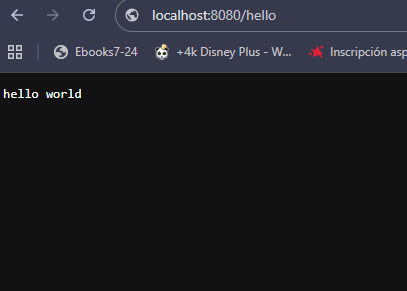
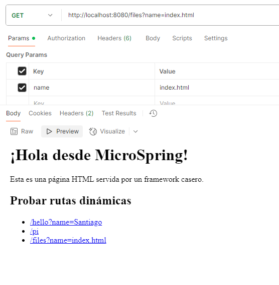

# microSpring

`microSpring` es un micro-framework web para Java, ligero y basado en anotaciones, inspirado en los principios de Spark. Está diseñado para crear aplicaciones web y APIs de forma rápida y con una configuración mínima.

## Características

*   **Enrutamiento basado en anotaciones:** Define controladores y rutas de forma declarativa utilizando `@RestController` y `@GetMapping`.
*   **Manejo de parámetros de solicitud:** Extrae fácilmente parámetros de consulta de las URLs con la anotación `@RequestParam`.
*   **Ligero y simple:** Construido con un enfoque minimalista para un arranque rápido y un uso sencillo.
*   **Servidor de archivos estáticos (implícito):** Capaz de servir archivos directamente desde el sistema de archivos.

## Primeros Pasos

Sigue estas instrucciones para tener una copia del proyecto funcionando en tu máquina local.

### Prerrequisitos

*   Java Development Kit (JDK) 11 o superior
*   Apache Maven

### Instalación

1.  **Clona el repositorio:**
    ```bash
    git clone 
    cd microSpring
    ```

2.  **Construye el proyecto:**
    Usa Maven para compilar el código fuente e instalar las dependencias.
    ```bash
    mvn clean install
    ```

## Uso

El framework te permite crear (endpoints) web de una manera muy sencilla. Solo necesitas crear una clase, anotarla como un controlador y añadir métodos (hasta el momento solo GET),
donde se le pueden pasar parametros por query.

### 1. Crea un Controlador

Anota tu clase con `@RestController` para que el framework la reconozca como un controlador web.

### 2. Define las Rutas

Usa la anotación `@GetMapping("/ruta")` en los métodos que quieras exponer como puntos de enlace HTTP GET.

### 3. Maneja los Parámetros

Utiliza `@RequestParam("nombreParam")` en los argumentos de tu método para capturar los parámetros de la consulta de la URL.

### Ejemplo Completo

Aquí tienes un ejemplo de un controlador que define varias rutas, asi podras crear tus clases con el microFramework.

```java
package co.edu.escuelaing.arep.reflexionlab.controller;

import co.edu.escuelaing.arep.reflexionlab.Anotations.GetMapping;
import co.edu.escuelaing.arep.reflexionlab.Anotations.RequestParam;
import co.edu.escuelaing.arep.reflexionlab.Anotations.RestController;

import java.io.IOException;
import java.nio.file.Paths;

import static java.nio.file.Files.readAllBytes;

@RestController
public class Controller {

    @GetMapping("/hello")
    public String hello(@RequestParam(value = "name", defaultValue = "World") String name) {
        return "hello " + name;
    }

    @GetMapping("/pi")
    public String pi() {
        return "3.141516";
    }
    @GetMapping("/files")
    public String getFiles(@RequestParam("name") String fileName) {
        String basePath = "src/main/resources/public/";
        String filePath = basePath + fileName;

        try {
            byte[] fileBytes = readAllBytes(Paths.get(filePath));
            return new String(fileBytes);
        } catch (IOException e) {
            return "Error al leer el archivo: " + fileName;
        }
    }
}
```

### 4. Inicia la Aplicación

Para iniciar el servidor, el framework escaneará las clases en busca de anotaciones y las registrará automáticamente, esto se hara de colocando por consola

```bash

java -cp target/classes co.edu.escuelaing.arep.reflexionlab.server co.edu.escuelaing.arep.reflexionlab.controller.Controller

```

## como algunos ejemplos podemos mostrar 

- el /hello con nombre en el query


- el hello sin query 



- el / pi sin query


- el servidor de archivos estaticos con /files y query de name


